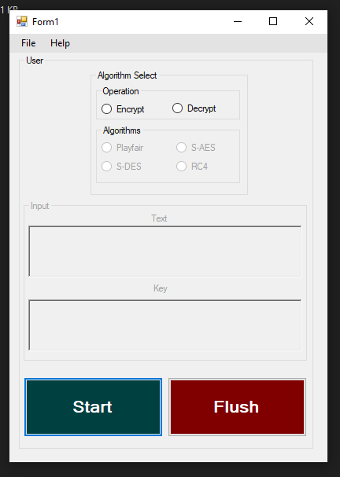
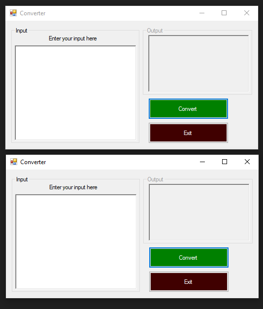

# Security-Algorithms
A simple Project performing simple Encryption and decryption algorithms, it only accepts binary and hex as input tho.
### Algorithms
*Playfair  
*S-Des  
*S-AES  
*RC4
### Instructions
1- Select the Operation Needed  
2- Select The algorithm Needed  
3- Enter the input text needed to be encrypted or decrypted  
4- Enter the Key if needed  
5- Press Start  
6- Press Flush to erease the data  

### SpecIal Notes
#### The file tab contains hex to binary converter and binary to hex converter if needed.

#### The help tab contains all the needed info to run the program
